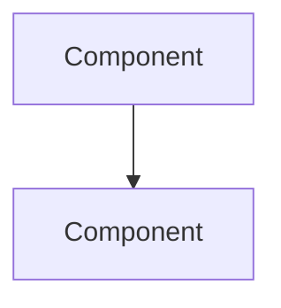

# Blueprint Rules (Antigravity)

Use these rules for workspaces using the "Blueprint" workflows in `.agent/workflows/`.

## Safety & Approval

- Ask for confirmation before any destructive or hard-to-reverse action (e.g., `rm`, `git push`, migrations, deleting data).
- Prefer small, reviewable changes; summarize intent before executing risky commands.

## Workflow Artifacts (Files)

Treat these files as the source of truth for the workflow state:
- `REQUIREMENTS.md` (user stories and acceptance criteria)
- `DESIGN.md` (technical decisions and architecture)
- `RESEARCH.md` (findings and links)
- `PLAN.md` (approved plan)
- `TODO.md` (checklist of tasks)
- `ACT.md` (implementation log with timestamps)
- `TEST.md` (test plan + results)

**Backup Policy**: If creating one of these files and it already exists, offer to:
1. Archive to `archive/<timestamp>/`
2. Use a new task directory like `tasks/<short-name>/`
3. Isolate work in a new VCS branch with `/bp-branch`

## Design Document Standards

When creating `DESIGN.md`, scale complexity to the feature:

### Simple Features (< 1 day)
Required sections:
- Overview
- Technical Approach
- Key Decisions table
- Components list

### Medium Features (1-5 days)
Add:
- Architecture diagram (Mermaid)
- Directory structure
- API specification
- Data models

### Complex Features (> 5 days)
Add:
- System context diagram
- Sequence diagrams for key flows
- Entity Relationship Diagram
- State diagrams (if stateful)
- Migration plan
- Testing strategy
- Risk assessment

### Diagram Requirements

Always use Mermaid for diagrams:

Required diagram types by feature:
| Feature Type | Required Diagrams |
|--------------|-------------------|
| New service | Component, Sequence, ERD |
| API changes | Sequence, Data models |
| UI changes | User flow, Component |
| Database changes | ERD, Migration sequence |
| Refactoring | Before/After architecture |

## Requirements Document Standards

When creating `REQUIREMENTS.md`, include:

### Minimum (all features)
- User stories in standard format
- Acceptance criteria (testable)
- Constraints and out of scope

### Recommended (medium+)
- User journey diagrams
- Success metrics
- Non-functional requirements

### Complex features
- Use case diagrams
- Stakeholder matrix
- Dependency tracking

## Plan Document Standards

When creating `PLAN.md`, include:

### Minimum
- Ordered task list
- Dependencies noted
- Success criteria

### Recommended
- Task dependency graph (Mermaid)
- Estimated timeline
- Risk assessment

### Complex
- Gantt chart
- Rollback plan
- Definition of Done

## Task Validation

- When running `/bp-implement`, all `[ ]` items in `TODO.md` must be resolved before proceeding to `/bp-test`.
- Items can be: completed `[x]`, deferred to a new TODO, or marked out of scope.
- Do not mark a workflow as complete with unresolved tasks.

## Planning Discipline

- For multi-step tasks, produce an explicit plan before editing code.
- Keep assumptions and open questions visible in `RESEARCH.md` / `PLAN.md`.
- Keep `TODO.md` accurate as work progresses (check off completed items and roll up parent tasks).
- Use `/bp-improve` to proactively review artifacts before implementation.

## Commit Conventions

- Use Conventional Commits for all commits:
  - `feat:` new features
  - `fix:` bug fixes
  - `docs:` documentation changes
  - `chore:` maintenance tasks
  - `refactor:` code restructuring
  - `test:` test additions/changes
- Keep commit messages concise but descriptive.
- Use `/bp-commit` to ensure consistent formatting.

## CI Awareness

- Before marking a workflow as complete, verify that CI passes on the current branch.
- If CI fails, use `/bp-refine` to address the issues before proceeding.
- Check `.github/workflows/` for available CI configurations.

## Conflict & Drift Handling

- If `PLAN.md` and `TODO.md` become out of sync (e.g., after `/bp-refine` changes scope), update `PLAN.md` to reflect the actual direction.
- If `ACT.md` shows significant deviation from `PLAN.md`, document the rationale and ask if the plan should be revised.
- Use `/bp-review` to audit consistency before finalizing work.

## Repository Hygiene

- Follow existing project conventions (style, structure, naming) and update relevant docs when behavior changes.
- Keep changes focused on the requested scope; avoid drive-by refactors.
