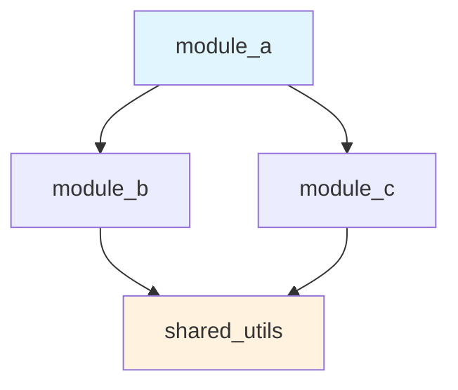
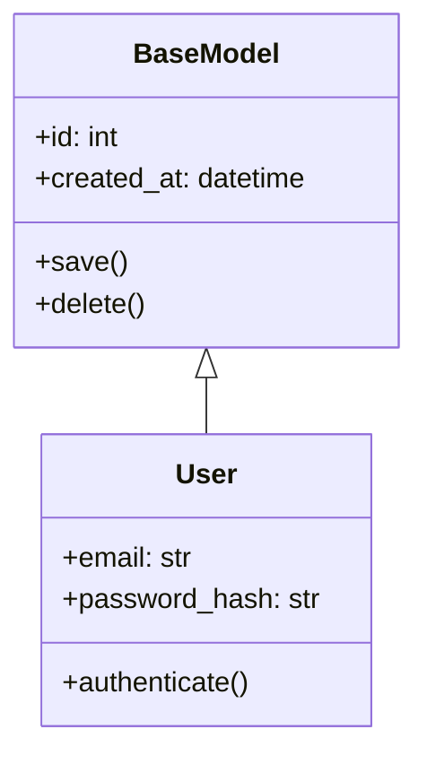
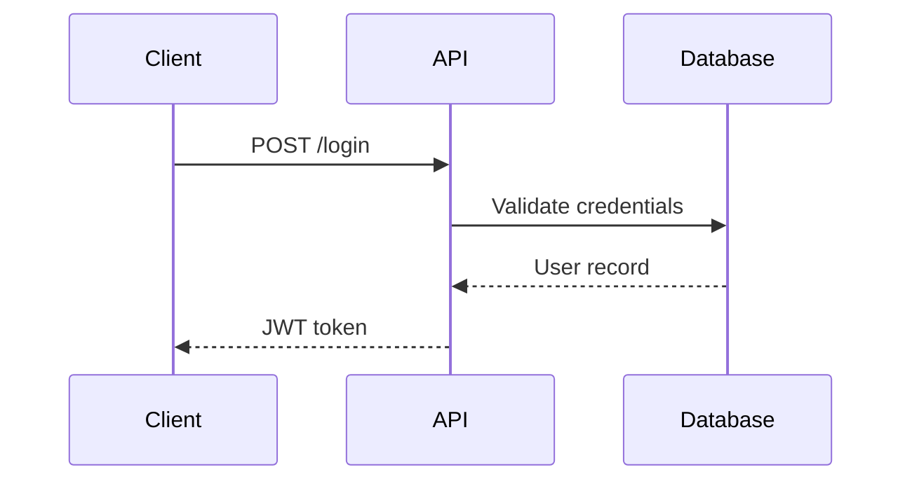
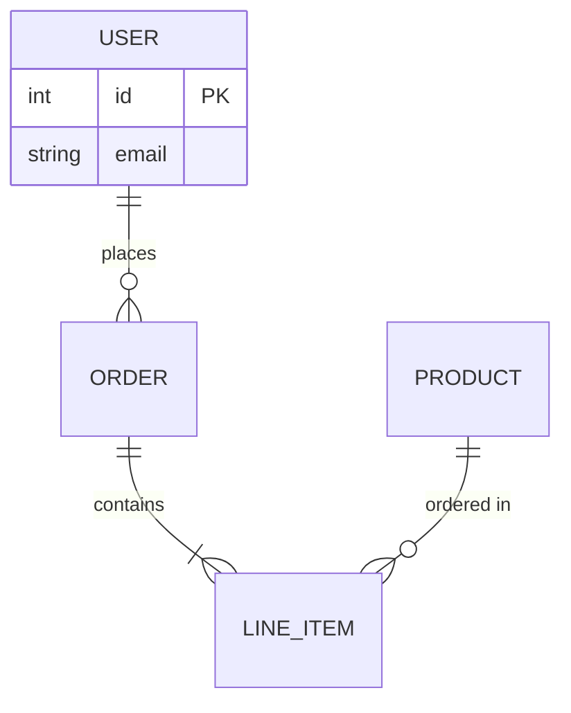
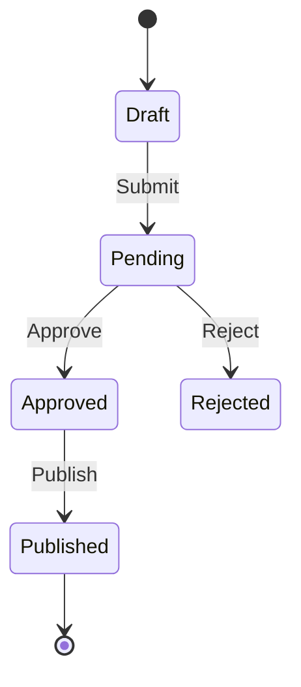
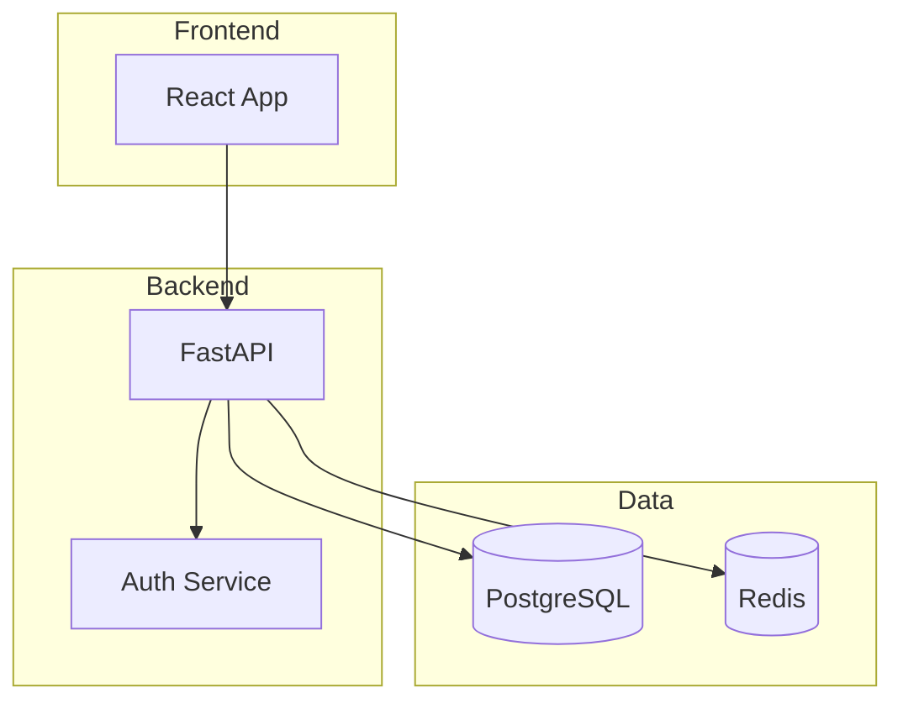
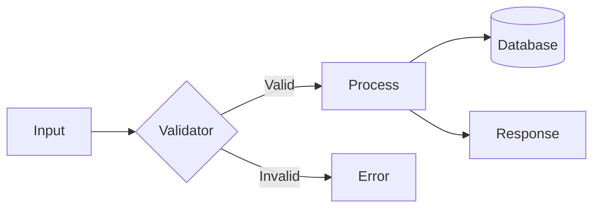
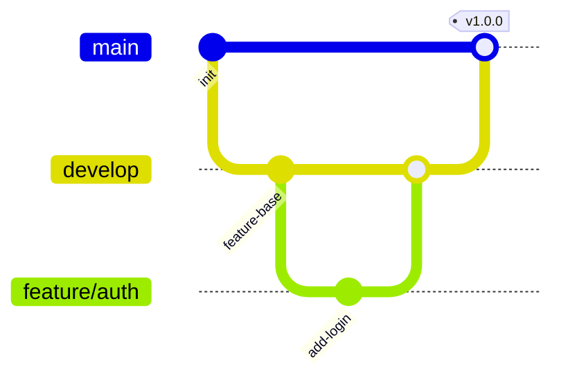

# Code Wiki Generator Rules (Antigravity)

Use these rules when running `/codewiki` or `/codewiki-update` to generate codebase documentation.

## Documentation Principles

- **Self-documenting**: Extract info from code, not hallucinate
- **Hierarchical**: Overview → Modules → Details
- **Cross-referenced**: Link symbols across pages
- **Scannable**: Tables, bullets, clear headings
- **Current**: Timestamp and version tracking

## Extraction Sources

### Primary (prefer these)
- Docstrings (Python, JS, Go, Rust)
- JSDoc/TSDoc comments
- README files per directory
- Type annotations and interfaces
- Function/method signatures

### Secondary (infer from)
- File names and structure
- Import statements
- Class inheritance
- Configuration files
- Test files (for usage examples)

## Wiki Structure

```
wiki/
├── index.md                    # Home: purpose, quick start, navigation
├── architecture.md             # High-level design, patterns, layers
├── getting-started.md          # Setup, dependencies, first run
├── modules/
│   ├── index.md                # Module directory with descriptions
│   └── <module>.md             # Per-module documentation
├── api/
│   ├── index.md                # API overview
│   ├── classes.md              # Class reference
│   └── functions.md            # Function reference
├── data-models.md              # Types, schemas, interfaces
├── configuration.md            # Env vars, config files, options
├── dependencies.md             # External deps, internal graph
└── changelog.md                # Version history (if available)
```

## Page Templates

### Module Page Template
```markdown
# [Module Name]

> One-line description from docstring or inferred

## Purpose
[2-3 sentences on what this module does]

## Key Components

| Component | Type | Description |
|-----------|------|-------------|
| `name` | class/function | brief description |

## Dependencies
- Internal: [modules this imports]
- External: [packages used]

## Usage Example
\`\`\`python
# from tests or docstrings
\`\`\`

## API Reference
[link to detailed API page or inline]
```

### Class Reference Template
```markdown
## ClassName

> Docstring first line

**Module**: `path.to.module`
**Inherits**: `ParentClass`

### Constructor
\`\`\`python
def __init__(self, param1: Type, param2: Type = default)
\`\`\`

### Methods

| Method | Signature | Description |
|--------|-----------|-------------|
| `method_name` | `(args) -> return` | brief |

### Properties
| Property | Type | Description |
|----------|------|-------------|
```

### Function Reference Template
```markdown
## function_name

> Docstring first line

**Module**: `path.to.module`

### Signature
\`\`\`python
def function_name(param1: Type, param2: Type = default) -> ReturnType
\`\`\`

### Parameters
| Name | Type | Default | Description |
|------|------|---------|-------------|

### Returns
| Type | Description |
|------|-------------|

### Example
\`\`\`python
result = function_name(arg1, arg2)
\`\`\`
```

## Diagram Standards

Use Mermaid for visual documentation. Generate diagrams automatically where possible.

### Module Dependency Graph
Auto-generate from import analysis. Include in `architecture.md` and `dependencies.md`.



### Class Hierarchy
Auto-generate from class inheritance. Include in `api/classes.md`.



### Sequence Diagrams
Create for key API flows, authentication, and multi-step processes.



### Entity Relationship Diagrams
Auto-generate from database models/schemas. Include in `data-models.md`.



### State Diagrams
Create for workflows, order status, user lifecycle, etc.



### Component/Architecture Diagrams
Create for high-level system overview. Include in `architecture.md`.



### Data Flow Diagrams
Show how data moves through the system.



### Git/Branching Diagrams
Document branching strategy.



## Auto-Generation Guidelines

When generating wikis, automatically create these diagrams:

| Diagram | Source | Location |
|---------|--------|----------|
| Module Dependencies | Import statements | `architecture.md`, `dependencies.md` |
| Class Hierarchy | Class inheritance | `api/classes.md` |
| ERD | ORM models, schema files | `data-models.md` |
| Component Overview | Directory structure | `architecture.md` |
| API Flows | Route definitions | `api/index.md` |

### Diagram Detection Heuristics

1. **Has ORM models?** → Generate ERD
2. **Has multiple services/packages?** → Generate component diagram
3. **Has API routes?** → Generate sequence diagram for key endpoints
4. **Has state machines/enums?** → Generate state diagram
5. **Has complex class hierarchies?** → Generate class diagram

## Incremental Updates

For `/codewiki-update`:
- Compare file modification times
- Only regenerate changed modules
- Update cross-references
- Preserve manual edits in designated sections

## Quality Checks

Before finalizing wiki:
- [ ] All public classes/functions documented
- [ ] No broken internal links
- [ ] Diagrams render correctly
- [ ] Examples are valid syntax
- [ ] Navigation is consistent
