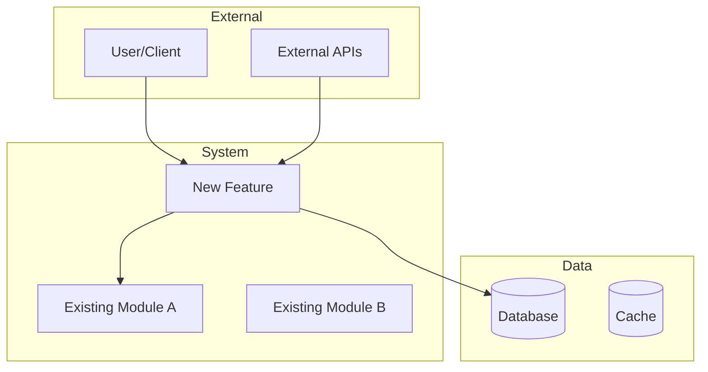
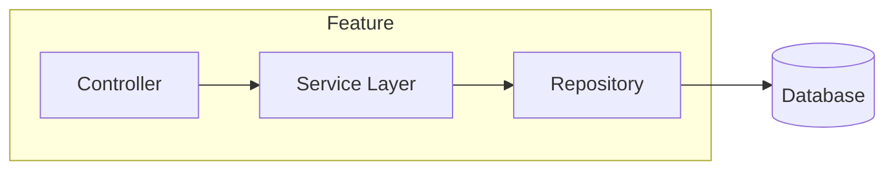
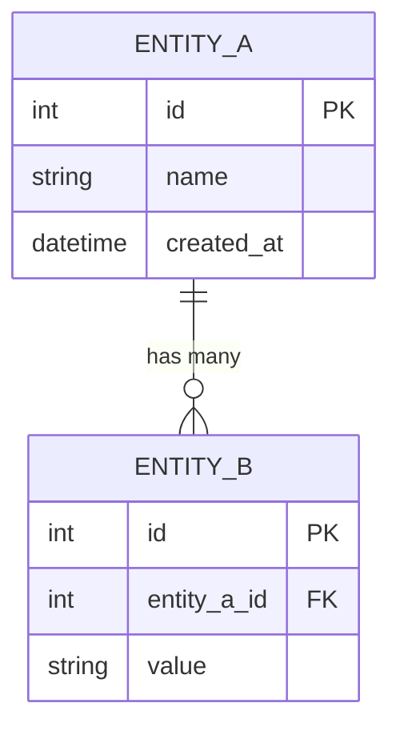
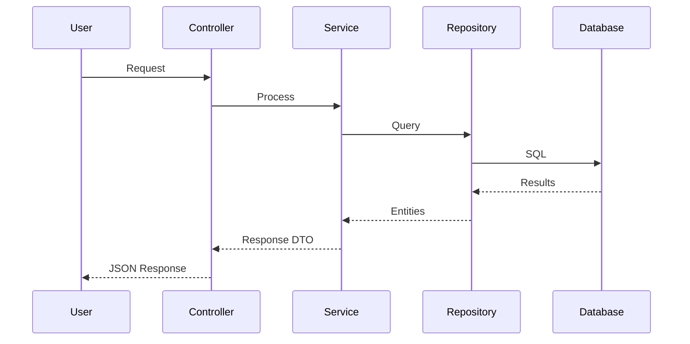
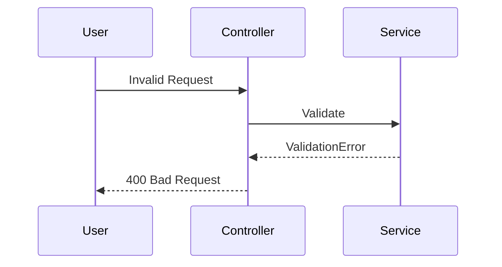
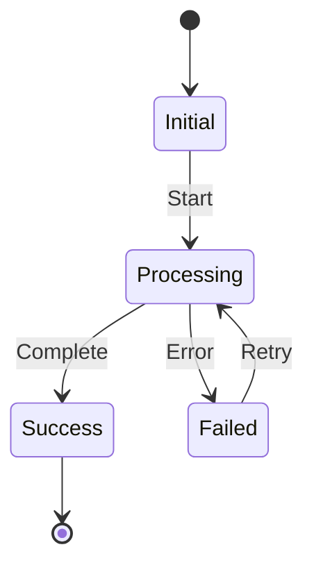

# bp-design

## Description

Create a comprehensive `DESIGN.md` documenting technical architecture, system design, and implementation strategy. Produces Kiro-style technical specification with diagrams.

## Steps

1. Use the text after `/bp-design` as the design topic. Ask clarifying questions about:
   - What are the key technical decisions?
   - What are the constraints (performance, compatibility, etc.)?
   - Are there alternative approaches to consider?
   - What is the expected scale/load?

2. **Check for existing file**: If `DESIGN.md` exists, offer to:
   - Archive it to `archive/<timestamp>/DESIGN.md`
   - Create in a task directory `tasks/<name>/DESIGN.md`
   - Overwrite

3. Locate `REQUIREMENTS.md` and `RESEARCH.md` if they exist; incorporate relevant context.

4. **Analyze the codebase** (if modifying existing):
   - Identify affected modules
   - Map current architecture
   - Note integration points

5. Create `DESIGN.md` with the following comprehensive structure:

```markdown
# Design: [Feature Name]

## Overview
[1-2 paragraph summary of what this design addresses and the approach taken]

## Requirements Reference
[Link to or summary of relevant requirements from REQUIREMENTS.md]

---

## Architecture

### System Context
[Where this feature fits in the overall system]



### Component Diagram
[Detailed view of the new/modified components]



---

## Directory Structure

Proposed file organization:

```
src/
├── feature_name/
│   ├── __init__.py
│   ├── controllers/
│   │   └── feature_controller.py
│   ├── services/
│   │   └── feature_service.py
│   ├── models/
│   │   └── feature_model.py
│   ├── repositories/
│   │   └── feature_repository.py
│   └── tests/
│       ├── test_controller.py
│       └── test_service.py
```

---

## Data Models

### Entity Relationship Diagram



### Schema Definitions
[Detailed field definitions, types, constraints]

---

## API Specification

### Endpoints

| Method | Path | Description | Auth |
|--------|------|-------------|------|
| GET | `/api/v1/resource` | List resources | Required |
| POST | `/api/v1/resource` | Create resource | Required |
| GET | `/api/v1/resource/{id}` | Get single resource | Required |

### Request/Response Examples

```json
// POST /api/v1/resource
// Request
{
  "name": "example",
  "value": 123
}

// Response (201)
{
  "id": 1,
  "name": "example",
  "value": 123,
  "created_at": "2024-01-01T00:00:00Z"
}
```

---

## Key Flows

### Primary Flow: [Name]



### Error Flow



---

## State Management

[If applicable - for stateful features]



---

## Key Decisions

| Decision | Rationale | Alternatives Considered |
|----------|-----------|------------------------|
| Use X for Y | [Why this choice] | A (rejected: reason), B (rejected: reason) |
| ... | ... | ... |

---

## Dependencies

### New Dependencies
| Package | Version | Purpose |
|---------|---------|---------|
| package-name | ^1.0.0 | Description |

### Internal Dependencies
- `module_a`: [What we need from it]
- `module_b`: [What we need from it]

---

## Trade-offs

| Trade-off | Chosen Approach | Impact |
|-----------|-----------------|--------|
| Consistency vs Availability | Chose consistency | Higher latency possible |
| ... | ... | ... |

---

## Risks & Mitigations

| Risk | Likelihood | Impact | Mitigation |
|------|------------|--------|------------|
| Risk description | High/Med/Low | High/Med/Low | How to address |

---

## Migration Plan

[If modifying existing code]

1. **Phase 1**: Add new tables/models (backward compatible)
2. **Phase 2**: Deploy new code with feature flag
3. **Phase 3**: Migrate data
4. **Phase 4**: Enable feature
5. **Phase 5**: Remove old code

---

## Testing Strategy

| Type | Coverage | Tools |
|------|----------|-------|
| Unit | Services, Repositories | pytest |
| Integration | API endpoints | pytest + httpx |
| E2E | Critical paths | playwright |

---

## Open Questions

- [ ] Question needing clarification
- [ ] Another question
```

6. Present `DESIGN.md` and request explicit approval.

7. Recommend next step: `/bp-plan` to create implementation plan.

## Output

- `DESIGN.md` (comprehensive technical specification)

## Design Complexity Levels

Adjust detail based on feature complexity:

| Complexity | Sections Required |
|------------|-------------------|
| **Simple** | Overview, Components, Key Decisions |
| **Medium** | + Architecture Diagram, API Spec, Data Models |
| **Complex** | + All diagrams, Migration Plan, Testing Strategy |
