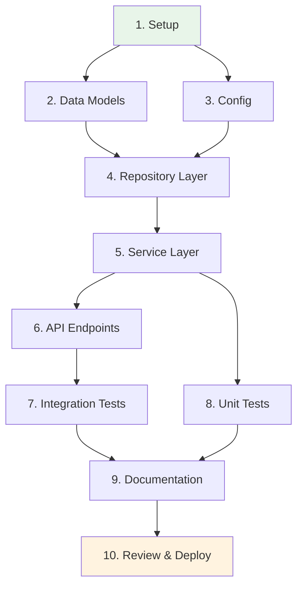
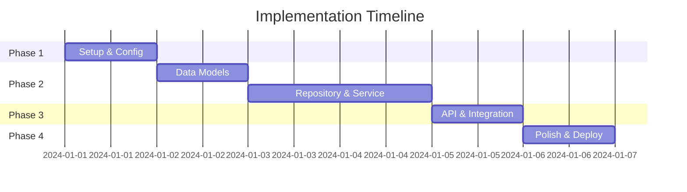

# bp-plan

## Description

Create a comprehensive, executable implementation plan with task dependencies, timeline, and risk assessment. Produces a structured `PLAN.md` that drives the implementation phase.

## Steps

1. Use the text after `/bp-plan` as the planning prompt; ask clarifying questions about goals, constraints, and success criteria.

2. Locate `RESEARCH.md`, `REQUIREMENTS.md`, and `DESIGN.md` if they exist; incorporate relevant findings.

3. **Check for existing files**: If `PLAN.md`, `TODO.md`, or `ACT.md` exist, offer to:
   - Archive them to `archive/<timestamp>/` (preserves history)
   - Move to a task directory `tasks/<completed-task-name>/`
   - Create a new branch with `/bp-branch`
   - Overwrite (not recommended)

4. If archiving, create the archive directory and move files:
   ```
   archive/
     2025-12-15T23-30/
       PLAN.md
       TODO.md
       ACT.md
   ```

5. Create `PLAN.md` with the following comprehensive structure:

```markdown
# Implementation Plan: [Feature Name]

## Overview
[Brief summary of what will be implemented and the approach]

**Estimated Effort**: [X days/hours]
**Complexity**: [Simple/Medium/Complex]
**Risk Level**: [Low/Medium/High]

---

## Prerequisites

- [ ] DESIGN.md approved
- [ ] Required dependencies available
- [ ] Development environment ready
- [ ] [Other prerequisites]

---

## Task Dependency Graph



---

## Implementation Phases

### Phase 1: Foundation [Day 1]

| # | Task | Depends On | Estimate | Verification |
|---|------|------------|----------|--------------|
| 1.1 | Create directory structure | - | 15m | Directories exist |
| 1.2 | Add dependencies | - | 15m | Package installs |
| 1.3 | Setup configuration | 1.1 | 30m | Config loads |

### Phase 2: Core Implementation [Day 2-3]

| # | Task | Depends On | Estimate | Verification |
|---|------|------------|----------|--------------|
| 2.1 | Implement data models | 1.x | 2h | Models validate |
| 2.2 | Implement repository | 2.1 | 2h | CRUD works |
| 2.3 | Implement service layer | 2.2 | 3h | Business logic passes |

### Phase 3: API & Integration [Day 4]

| # | Task | Depends On | Estimate | Verification |
|---|------|------------|----------|--------------|
| 3.1 | Implement API endpoints | 2.3 | 2h | Endpoints respond |
| 3.2 | Add authentication | 3.1 | 1h | Auth works |
| 3.3 | Integration tests | 3.2 | 2h | Tests pass |

### Phase 4: Polish & Deploy [Day 5]

| # | Task | Depends On | Estimate | Verification |
|---|------|------------|----------|--------------|
| 4.1 | Documentation | 3.x | 1h | Docs complete |
| 4.2 | Code review | 4.1 | 1h | Review approved |
| 4.3 | Deploy to staging | 4.2 | 30m | Staging works |
| 4.4 | Production deploy | 4.3 | 30m | Prod verified |

---

## Timeline



---

## Risk Assessment

| Risk | Likelihood | Impact | Mitigation | Contingency |
|------|------------|--------|------------|-------------|
| Dependency issues | Medium | High | Lock versions | Use alternatives |
| Scope creep | High | Medium | Strict scope doc | Defer to v2 |
| Integration failures | Low | High | Early integration | Rollback plan |

---

## Rollback Plan

If issues occur:
1. Revert commits: `git revert <commit-range>`
2. Restore database: [backup procedure]
3. Notify stakeholders
4. Document lessons learned

---

## Success Criteria

- [ ] All acceptance criteria from REQUIREMENTS.md met
- [ ] All tests passing (unit, integration, e2e)
- [ ] Documentation complete
- [ ] Code review approved
- [ ] Deployed to production
- [ ] Monitoring in place

---

## Definition of Done

A task is complete when:
- [ ] Code written and self-reviewed
- [ ] Unit tests written and passing
- [ ] Documentation updated
- [ ] No linting errors
- [ ] Committed with conventional commit message

---

## Notes

[Any additional context, links, or considerations]
```

6. Present the plan and request explicit approval before proceeding.

7. Recommend the next step: run `/bp-define` to break into actionable tasks.

## Output

- `PLAN.md` (comprehensive implementation plan)

## Complexity Levels

Adjust detail based on project size:

| Complexity | Sections Required |
|------------|-------------------|
| **Simple** | Overview, Task List, Success Criteria |
| **Medium** | + Dependency Graph, Timeline, Risks |
| **Complex** | + Gantt chart, Rollback Plan, DoD |
