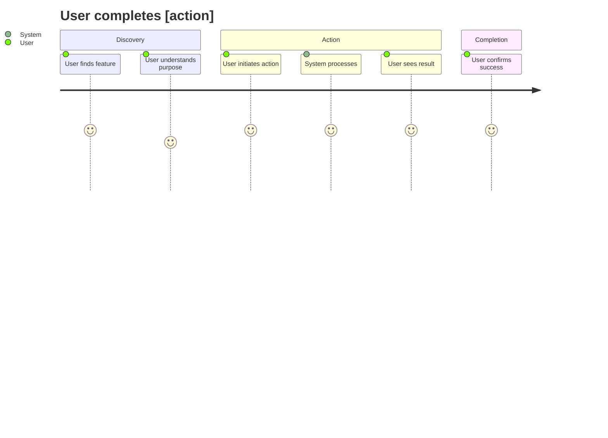
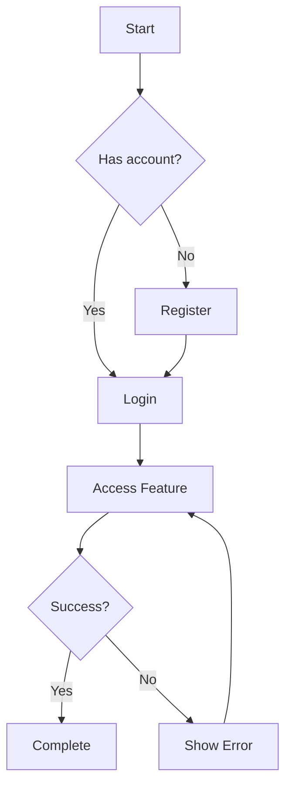
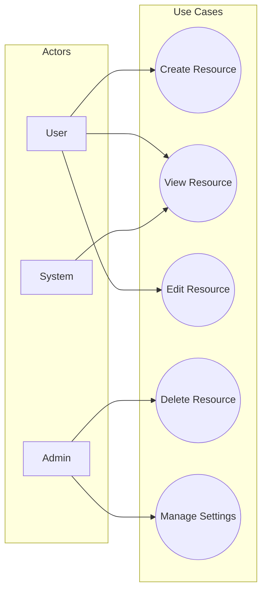

# bp-requirements

## Description

Create a comprehensive `REQUIREMENTS.md` with user stories, acceptance criteria, user journeys, and success metrics. Produces structured requirements that drive design and implementation.

## Steps

1. Use the text after `/bp-requirements` as the feature/goal description. Ask clarifying questions about:
   - Who are the users/stakeholders?
   - What problem is being solved?
   - What are the success criteria?
   - What are the constraints?
   - What is out of scope?

2. **Check for existing file**: If `REQUIREMENTS.md` exists, offer to:
   - Archive it to `archive/<timestamp>/REQUIREMENTS.md`
   - Create in a task directory `tasks/<name>/REQUIREMENTS.md`
   - Overwrite

3. Locate `RESEARCH.md` if it exists; incorporate relevant findings.

4. Create `REQUIREMENTS.md` with the following comprehensive structure:

```markdown
# Requirements: [Feature Name]

## Executive Summary
[2-3 sentence overview of what this feature does and why it matters]

---

## Stakeholders

| Stakeholder | Role | Needs |
|-------------|------|-------|
| End Users | Primary users | [What they need] |
| Admins | System administrators | [What they need] |
| Developers | Maintainers | [What they need] |

---

## User Stories

### Epic: [High-level feature]

| ID | As a... | I want... | So that... | Priority |
|----|---------|-----------|------------|----------|
| US-001 | user | to do X | I can achieve Y | Must Have |
| US-002 | admin | to configure Z | system behaves correctly | Should Have |
| US-003 | developer | clear API docs | I can integrate easily | Could Have |

### Story Details

#### US-001: [Title]
**As a** [user type]
**I want** [goal/desire]
**So that** [benefit/value]

**Acceptance Criteria:**
- [ ] Given [context], when [action], then [outcome]
- [ ] Given [context], when [action], then [outcome]

---

## User Journeys

### Journey 1: [Primary Happy Path]



### Journey 2: [Alternative Path]



---

## Use Cases



---

## Acceptance Criteria Matrix

| ID | Criterion | User Story | Testable | Priority |
|----|-----------|------------|----------|----------|
| AC-001 | User can create resource in < 3 clicks | US-001 | Yes | Must |
| AC-002 | System responds in < 200ms | US-001 | Yes | Must |
| AC-003 | Error messages are actionable | US-001 | Yes | Should |
| AC-004 | Works on mobile devices | US-002 | Yes | Should |

---

## Functional Requirements

| ID | Requirement | Priority | Notes |
|----|-------------|----------|-------|
| FR-001 | System shall allow users to... | Must Have | |
| FR-002 | System shall validate... | Must Have | |
| FR-003 | System shall notify... | Should Have | |

---

## Non-Functional Requirements

| Category | Requirement | Target | Measurement |
|----------|-------------|--------|-------------|
| Performance | Response time | < 200ms | p95 latency |
| Scalability | Concurrent users | 1000+ | Load test |
| Availability | Uptime | 99.9% | Monitoring |
| Security | Authentication | OAuth 2.0 | Security audit |
| Accessibility | WCAG compliance | Level AA | Audit |

---

## Constraints

| Type | Constraint | Impact |
|------|------------|--------|
| Technical | Must use existing database | Schema design |
| Time | Deadline: [date] | Scope prioritization |
| Resource | Team of 2 developers | Capacity planning |
| Compatibility | Support browsers X, Y, Z | Testing requirements |

---

## Assumptions

- [ ] Users have internet connectivity
- [ ] Users have modern browsers
- [ ] [Other assumptions]

---

## Dependencies

| Dependency | Owner | Status | Risk if Delayed |
|------------|-------|--------|-----------------|
| API v2 release | Backend team | In Progress | High |
| Design mockups | Design team | Complete | N/A |

---

## Out of Scope

Explicitly NOT included in this release:
- Feature X (planned for v2)
- Integration with Y (separate initiative)
- [Other exclusions]

---

## Success Metrics

| Metric | Current | Target | Measurement Method |
|--------|---------|--------|-------------------|
| User adoption | 0 | 500 DAU | Analytics |
| Task completion rate | N/A | > 90% | User testing |
| Error rate | N/A | < 1% | Monitoring |
| User satisfaction | N/A | > 4.0/5 | Survey |

---

## Open Questions

- [ ] Question needing stakeholder input
- [ ] Another question

---

## Approval

| Role | Name | Date | Signature |
|------|------|------|-----------|
| Product Owner | | | |
| Tech Lead | | | |
```

5. Present `REQUIREMENTS.md` and request explicit approval.

6. Recommend next step: `/bp-design` for technical design.

## Output

- `REQUIREMENTS.md` (comprehensive requirements specification)

## Complexity Levels

Adjust detail based on project size:

| Complexity | Sections Required |
|------------|-------------------|
| **Simple** | Overview, User Stories, Acceptance Criteria, Constraints |
| **Medium** | + User Journeys, NFRs, Success Metrics |
| **Complex** | + All diagrams, Dependencies, Approval section |
